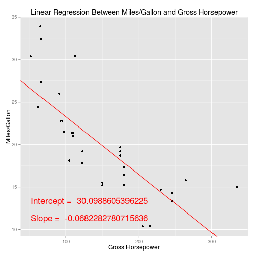

Mileage per Gallon Relationship With Other Car Aspects
========================================================
author: Carlos Barboza
date: 2015/06/19
transition: rotate

Motivation
========================================================

Car's fuel consumption is one of the main performance characteristics 
observed when buying a car. Mostly when oil price is high.

The developed application, aims to present the relationship of fuel 
consumption in **MPG** (Miles per Gallon) to other car aspects, such as:

- Car Axle Ratio
- Gross Horsepower
- Displacement

Application uses data available on the mtcars dataset, documentation about 
the dataset can be obtained [here](https://stat.ethz.ch/R-manual/R-devel/library/datasets/html/mtcars.html).

Using the Application
========================================================

The application is hosted on ShinyApps and can be accessed on the folowing URL:

[https://brbza.shinyapps.io/devdataprod-015](https://brbza.shinyapps.io/devdataprod-015)

Its usage is very simple, you need to select a car aspect on the combo box named "Car Aspect" on the left side of the window. Once an aspect is selected, the plot on the right side of the window is updated, showing the relationship of the selected aspect with fuel consumption in MPG.

Additionaly, a linear regression is performed on the background, the line is plotted along with the selected data and the intercept and slope coefficients are displayed on the plot as well.


Linear Regression
========================================================

The linear regression is performed using R's built in function **lm**. The R code chunck 
below demonstrate how this operation is performed and how the coefficients are obtained. For
this example we will obtain the relationship between Gross Horsepower and MPG.


```r
data(mtcars)
coefficients <- lm(mpg ~ hp, data = mtcars)$coef
coefficients
```

```
(Intercept)          hp 
30.09886054 -0.06822828 
```


Results
========================================================

Results are displayed on a plot on the right side of the main page using the ggplot2 library.


Therefore, the application user can have a clear view of the relationship of the selected car aspect with fuel consumption.

***

 


